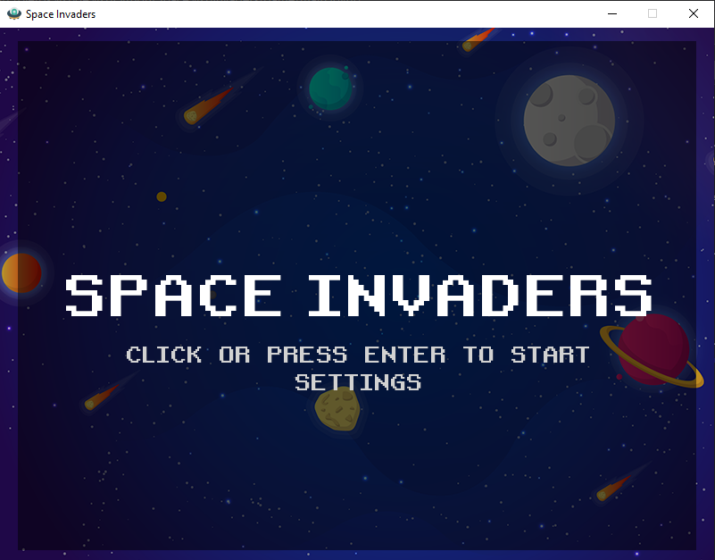
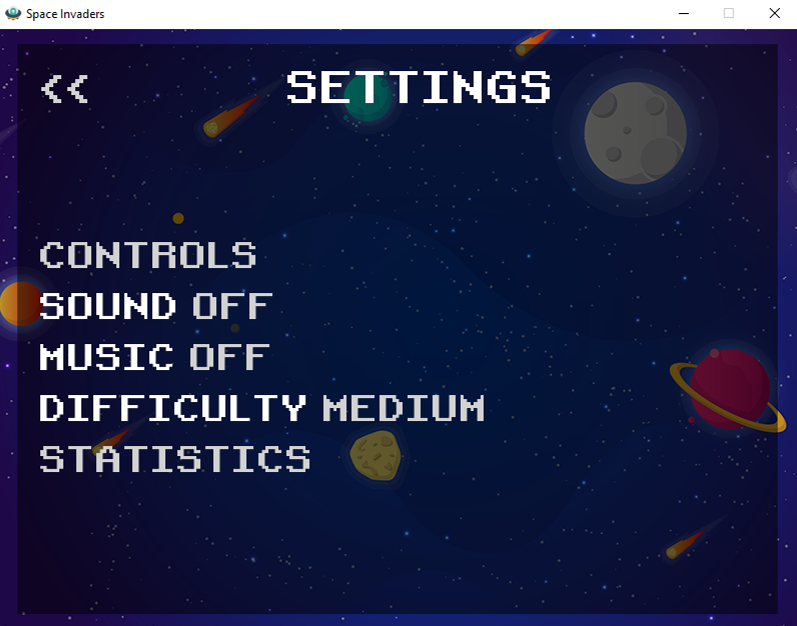
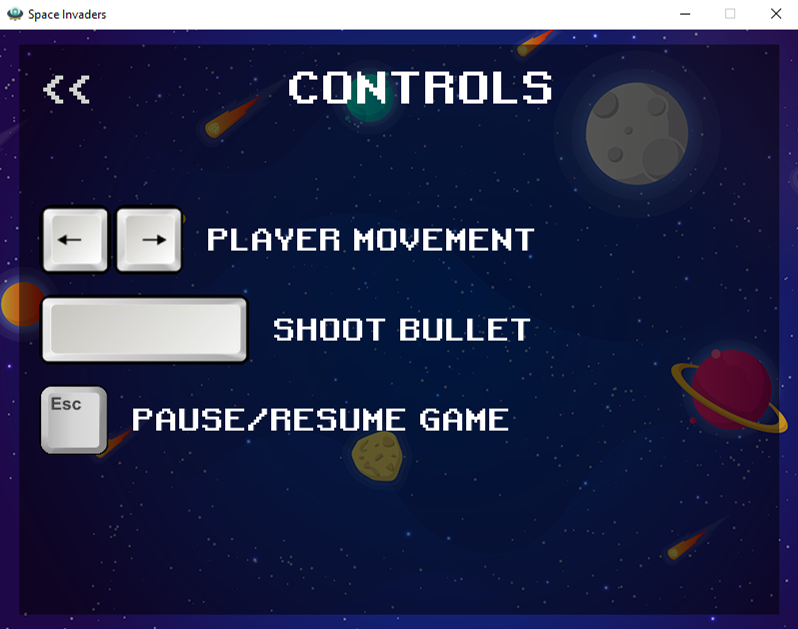
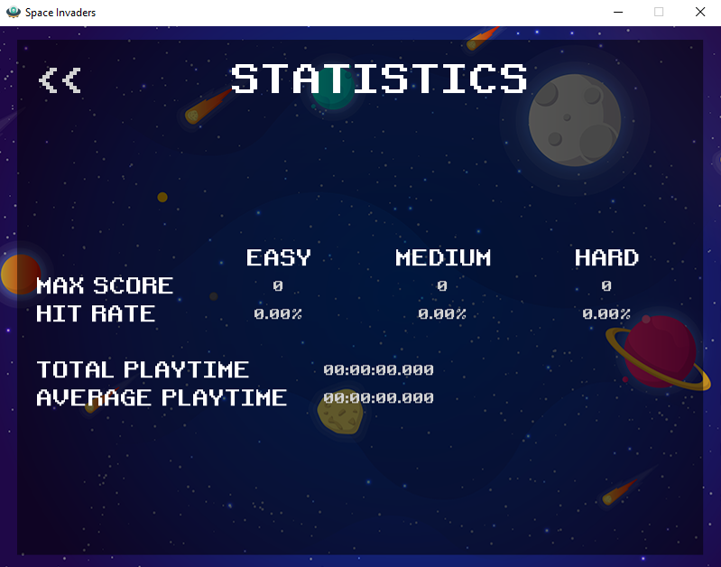
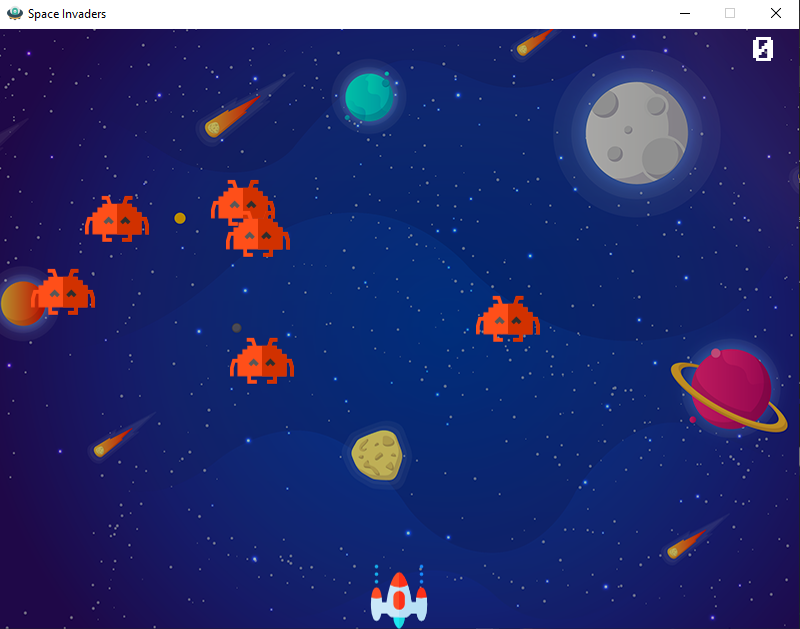
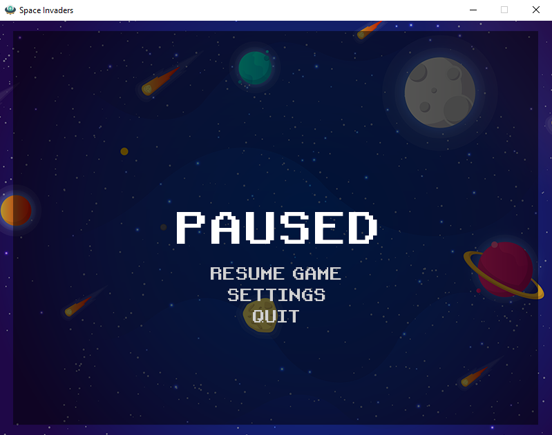

# Space Invaders
---

Space Invaders game made with Python, using the Pygame library. Intended for personal learning and non-commercial use. Please let me know if this game infriges any copyright.

Rebuilt upon the freeCodeCamp's [2019 Pygame tutorial](https://www.youtube.com/watch?v=FfWpgLFMI7w&ab_channel=freeCodeCamp.org) code (published [here](https://github.com/attreyabhatt/Space-Invaders-Pygame)).
<br></br>
## Requirements

- Python 3.9.7
- Pygame 2.1.3.dev4
- Pyinstaller 5.0.1
<br></br>

## Generating .exe
```
pyinstaller --onefile -w --icon="ufo.ico" --add-data="arrow keys.png;." --add-data="background.png;." --add-data="background.wav;." --add-data="bullet.png;." --add-data="enemy.png;." --add-data="esc.png;." --add-data="explosion.wav;." --add-data="laser.wav;." --add-data="player.png;." --add-data="Retro Gaming.ttf;." --add-data="spacebar.png;." --add-data="ufo.ico;." main.py
```

## Overview

For learning purposes, this code is a complete recreation of the tutorial's. The regular functions and variables of the original were replaced by sprites, and several menus were added:











